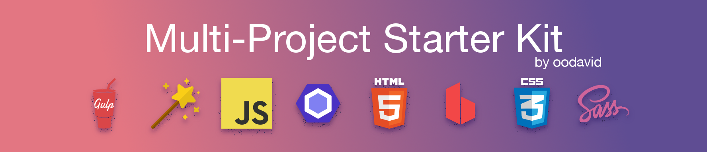

<p align="center">
  
  <br>
  <a href="https://github.com/oodavid/multi-project-starter-kit">Multi-Project Starter Kit</a> by <a href="https://github.com/oodavid">oodavid</a>.
</p>

<p align="center">
  Develop multiple projects with a single task runner.
</p>

# Quick Start

[Download the starter kit](releases/latest) or clone the repository.

Then install the dependencies:

```sh
npm install --global gulp
npm install
```

Now run `gulp` or `gulp --silent` to start developing

<p align="center">
  
</p>

# Features

##   Gulp + Magic

Just run `gulp` and be prompted for:

* The project in your `/projects` directory
* The environment from your `/env` directory - _production, sandbox, etc._
* And the task to run - _develop, build, etc._

##   CSS + SASS

Works out of the box with:

* [SASS](http://sass-lang.com/)
* [Minify and Uglify](https://en.wikipedia.org/wiki/Minification_(programming))
* [Sourcemaps](https://developers.google.com/web/tools/chrome-devtools/javascript/source-maps)

##   Javascript + ESLint

Promote best practices and use the latest features

* [ESlint](https://eslint.org)
    * Root Config File
    * Automatic Linting during development
* ✋ [VSCode Extension](https://github.com/Microsoft/vscode-eslint)
* ✋ [Sublime Plugin](https://github.com/SublimeLinter/SublimeLinter-eslint)

##   HTML + BrowserSync

Local development with style and speed

* [Browsersync](https://www.browsersync.io)
    * Live Reload
    * CSS injection
    * Cross-Device Synchronization

# Directory Structure

* `📁 projects/` - create your web projects here, one directory each
* `📁 env/` - create your environment directories here (they're copied to the active project before build)
* `📁 build/` - projects build to, and serve from, this folder
* `📁 gulp/` - task runner logic

# Todo

* README
    * Link to Udemy Course
    * ✋ See [Accredible Readme](https://github.com/accredible/accredible-frontend/blob/master/README.md)
    * ✋ See [Google Web Starter Kit](https://github.com/google/web-starter-kit/)
* Consider adding Service-Worker pre caching. See: [web-starter-kit](https://github.com/google/web-starter-kit/blob/master/gulpfile.babel.js)

#### References

* [Google Web Starter Kit](https://github.com/google/web-starter-kit) - uses `babel-register`, which is nice, but also slow
* [BrowserSync + Gulp js](https://browsersync.io/docs/gulp)
* [Simple Gulp'y Workflow for SASS](https://www.sitepoint.com/simple-gulpy-workflow-sass/)
* [How to Organize your Gulp.js Development Builds for Multiple Environments](https://www.freshconsulting.com/how-to-organize-your-gulp-js-development-builds-for-multiple-environments/)
* [angular-seed](https://github.com/angular/angular-seed)
* [angular-seed-es6](https://github.com/gusgard/angular-seed-es6)
* [angularjs-gulp-browserify-boilerplate](https://github.com/jakemmarsh/angularjs-gulp-browserify-boilerplate)

# Attribution

When using the Multi-Project Starter Kit, you must include the following attribution in your **README** file:

<p align="center">
  <a href="https://github.com/oodavid/multi-project-starter-kit">
    
  </a>
  <br>
  Built with the <a href="https://github.com/oodavid/multi-project-starter-kit">Multi-Project Starter Kit</a> by <a href="https://github.com/oodavid">oodavid</a>.
</p>
